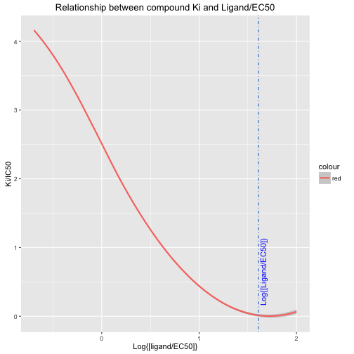

## Objective
This assignment aims to build a widget utilizing Shiny application containing a ui.R input file and a reactive output server.R file. This slide deck contains a Reproducible Presentation that includes four slides developed using Slidify and is hosted on GitHub containing embedded R code. 

- Links to Project App & Docs 
- <a href="https://ubali1.shinyapps.io/shiny/">Shiny App</a>
- <a href="https://github.com/ubali1/DDP.git">server.R and ui.R</a>

--- 

## Function
The widget plots a theoretical relationship between a compound's $K_i$ and the ligand's $EC_{50}$ in a typical competition experiment. This is modeled after the typical Cheng Prusoff correction as described in the following equation: 

$$K_i = \frac{IC_{50}}{(1+\frac{[Ligand]}{K_L})}$$

Tab 2, likewise, illustrates the theoretical relationship between a ligand's $EC_{50}$ in the presence of a competitive antagonist. Increasing concentrations of the antagonist [B] would lead to a right shift in the concentration response curve for the ligand as can be visualized using the widget. This relationship is modeled using the Gaddum equation listed below: 

$$\frac{[AR]}{R_{tot}} = \frac{[A]}{K_A(1+\frac{[B]}{K_D})+[A]}$$

---

## Explanation


<div style='text-align: center;'>
    
</div>

We expect to see change in apparent $K_i$ with changes in $EC_{50}$

  --When $EC_{50}$ ~ 10 nM, [L] is ~10 x $EC_{50}$ ~ 91% occupancy
  
  --When $EC_{50}$ ~ 30 nM, [L] is ~3 x $EC_{50}$ ~ 70% occupancy

We would, therefore, expect to see ~ 3-fold change in $K_i$ when testing [L] at 10 nM vs 30 nM. Furthermore, the change in $K_i$ is more pronounced at low receptor occupancy when [L] < $EC_{50}$


---

## An Example Code from the Widget


```r
      library(ggplot2)
```

```
## Warning: package 'ggplot2' was built under R version 3.2.4
```

```r
      EC50 <- seq(from = 1, to = 500, by = 5)
      x_axis <- log10((100/EC50))
      y_axis <- ((100/(1+(100/EC50)))/20)
      mu <- log(100/20)
        
      #plot(x_axis, y_axis, type='l',lwd=1, lxlab='Log{[ligand/EC50]}', ylab = 'Ki/IC50', col='blue',main='Relationship between compound Ki and Ligand EC50')
      qplot(x_axis, y_axis, geom = "smooth", xlab='Log{[ligand/EC50]}', ylab = 'Ki/IC50', color='red',main='Relationship between compound Ki and Ligand/EC50') + geom_vline(xintercept = mu, col = "dodgerblue3", lty="dotdash") + geom_text(aes(x=mu+0.05, label="Log{[Ligand/EC50]}", y=0.65), colour="blue", angle=90)
```



---
